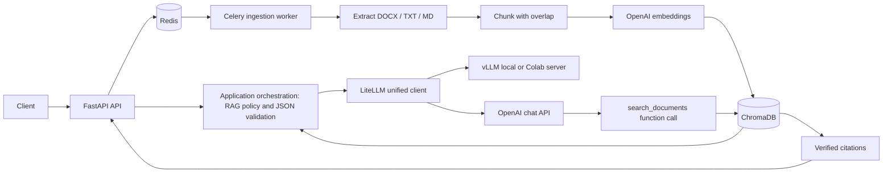

# Task 2 — Production Document Research Assistant

## Run the complete application

1. Copy `.env.example` to `.env`, then add `OPENAI_API_KEY`. Keep the existing
   vLLM values only when you want the optional vLLM route.
2. Start the production-shaped local stack:

   ```bash
   docker compose up --build
   ```

3. Open the Streamlit UI at <http://localhost:8501>.

   - Choose **OpenAI** for the tool-calling demonstration, or **vLLM** for the
     Colab/local open-source model route.
   - Upload a document in the sidebar and select **Queue document**.
   - Select **Check indexing status** until it reports `indexed`.
   - Ask a question. The answer panel shows verified sources plus provider,
     cache, fallback, and latency metadata.

   API Swagger is at <http://localhost:8080/docs>; readiness is
   <http://localhost:8080/api/health/ready>.
4. Stop it with `docker compose down`.

The browser only calls FastAPI. FastAPI owns retrieval, verified ChromaDB
citations, LiteLLM routing, retries, rate limits, Redis caching, and the
vLLM-to-OpenAI fallback policy.

### Production techniques implemented

- `POST /api/chat`: `allow_fallback: true` is opt-in and only permits
  `vllm → openai`; OpenAI never falls back to vLLM. Responses show requested
  and actual provider, cache/fallback status, and latency.
- `POST /api/chat/batch`: accepts 1–10 requests and limits active model calls
  to 3. Each result is returned independently, so one unavailable provider
  does not discard the other answers.
- Redis provides a 10-minute successful-answer cache and fixed-window limits:
  20 chat requests/minute/IP and 10 uploads/minute/IP. Indexing increments a
  collection version, so old RAG answers are automatically bypassed.
- Provider attempts use up to three attempts with exponential backoff before a
  user-enabled vLLM fallback. Failures return safe `429`, `503`, or `502`
  messages without provider secrets or stack traces.

### Streamlit UI behavior

The Streamlit service is intentionally a presentation layer, not an LLM
client. Its only backend address is `API_BASE_URL=http://api:8080` inside
Docker Compose. This keeps keys, retry logic, cache behavior, and citation
validation on the server.

| UI control | FastAPI action | What it demonstrates |
| --- | --- | --- |
| Provider selector | `POST /api/chat` with `provider` | Hosted OpenAI or locally/Colab-served vLLM routing |
| Fallback toggle | `allow_fallback: true` | Controlled vLLM → OpenAI graceful degradation |
| Document upload | `POST /api/documents/ingest` | Asynchronous Celery extraction, chunking, embedding, and indexing |
| Job-status button | `GET /api/jobs/{job_id}` | Non-blocking background processing |
| Chat input | `POST /api/chat` | RAG answer, verified ChromaDB citations, cache/fallback/latency status |

### Architecture

```mermaid
flowchart LR
  User[User browser] --> UI[Streamlit UI :8501]
  UI -->|HTTP only| API[FastAPI API :8080]
  subgraph API_PROCESS[FastAPI application]
    API --> Limit[Redis fixed-window rate limiter]
    API --> Cache[Redis response cache]
    API --> Chat[Chat service]
    Chat --> RAG[RAG retrieval + verified citations]
    Chat --> Retry[3 attempts + exponential backoff]
    Retry --> Gateway[LiteLLM gateway]
    API --> Batch[Batch endpoint<br/>maximum 3 active calls]
    API --> Queue[Celery job queue]
  end
  RAG --> Chroma[(ChromaDB vector collection)]
  Gateway --> OpenAI[OpenAI<br/>chat, tool calls, embeddings]
  Gateway --> VLLM[vLLM<br/>local or Colab/ngrok]
  Retry -->|only if vLLM fails and toggle enabled| OpenAI
  Queue --> Worker[Celery worker]
  Worker --> Chunk[extract + chunk + embed]
  Chunk --> Chroma
  Worker -->|increment collection version| Cache
  Redis[(Redis)] --- Limit
  Redis --- Cache
  Redis --- Queue
```



### ONNX decision

ONNX conversion is not applicable here: this project does not own or train the
deployed model. OpenAI is hosted, while Qwen is served by vLLM; vLLM already
provides the relevant serving, continuous batching, and inference optimization.
Docker Compose is the intended deployment target; cloud deployment is outside
this assignment scope.

---

# Task 1 reference — Document Research Assistant

A provider-agnostic AI assistant built incrementally for the Applied AI problem
set. It uses LiteLLM as one provider-neutral client for OpenAI and vLLM, with
application-owned RAG, structured JSON, and document-search tool orchestration
backed by ChromaDB.

## Quick start — run the application

1. Create `.env` from the tracked template, then add your OpenAI key. Do not
   change provider variables to switch models; provider selection is per chat
   request.

   ```bash
   cp .env.example .env
   ```

   ```env
   OPENAI_API_KEY=sk-your-key-here
   ```

2. Start the complete local application:

   ```bash
   docker compose up --build
   ```

3. Open Swagger: <http://localhost:8080/docs>.

4. Use these operations in order:

   - `POST /api/documents/ingest` — upload a `.txt`, `.md`, `.docx`, or
     text-based `.pdf`.
   - `GET /api/jobs/{job_id}` — wait for the result to say `"status":"indexed"`.
   - `POST /api/chat` — ask a question. Choose the visible **OpenAI** example
     for the most reliable final demo.

5. Stop the application when finished:

   ```bash
   docker compose down
   ```

### Optional: run the vLLM Colab demo

This is a second model route, not a replacement for the Docker application.
Docker still runs FastAPI, Celery, Redis, and ChromaDB on your computer; Colab
only runs the open-source model on a GPU.

1. Open [colab_vllm_ngrok.ipynb](notebooks/colab_vllm_ngrok.ipynb) in Google
   Colab. Select **Runtime → Change runtime type → T4 GPU**, then run every
   cell in order. Keep the final vLLM/ngrok cells running.
2. The notebook asks for an ngrok authtoken and a vLLM API key, then prints a
   public HTTPS URL. Copy the URL and the same vLLM API key into `.env`:

   ```env
   VLLM_BASE_URL=https://YOUR-CURRENT-NGROK-URL.ngrok-free.app/v1
   VLLM_API_KEY=the-key-you-entered-in-Colab
   VLLM_SERVED_MODEL_NAME=colab-qwen
   ```

3. Start or restart the local app with `docker compose up --build`, open
   Swagger, and send this request to `POST /api/chat`:

   ```json
   {
     "query": "What are the main TA-MAS research themes?",
     "provider": "vllm"
   }
   ```

You never set `LLM_PROVIDER` or restart the app just to switch models. Use
`"provider":"openai"` or `"provider":"vllm"` in each request. A free ngrok
URL changes when Colab restarts, so update only `VLLM_BASE_URL` after a new
tunnel is created.

## Task 1 architecture (reference)



FastAPI `async` endpoints efficiently await short I/O operations such as LLM
calls. Celery is for slow, retryable, durable work such as a batch of documents:
the API returns a job ID immediately, while a separate worker processes it.

## Requirements

- Docker Desktop with Docker Compose, recommended for the full stack
- An OpenAI API key for the `/api/chat` endpoint in OpenAI mode

No OpenAI key is needed to run the health endpoint, view Swagger, or test the
application because tests use fake clients rather than making paid network
requests. A real document upload needs `OPENAI_API_KEY` for embeddings, even
when vLLM is selected as the chat provider.

## Docker setup details

1. Create your local configuration file. It is ignored by Git, so never commit
   its API key.

   ```bash
   cp .env.example .env
   ```

2. Edit `.env` and set your key:

   ```env
   OPENAI_API_KEY=sk-your-key-here
   OPENAI_MODEL=gpt-4o-mini
   LLM_TEMPERATURE=0.2
   LLM_TOP_P=0.9
   EMBEDDING_MODEL=text-embedding-3-small
   ```

   Temperature controls randomness; `0.2` favors consistent factual answers.
   `top_p=0.9` is nucleus sampling. Keep both stable for this assignment unless
   you are deliberately evaluating prompt behavior.

3. Start the API, Redis, and the Celery worker:

   ```bash
   docker compose up --build
   ```

   Docker automatically uses `redis://redis:6379/0` for the API and worker;
   `REDIS_URL=redis://localhost:6379/0` in `.env` is only for a local,
   non-Docker run. `VLLM_BASE_URL` is never overridden, so it can point either
   to the optional `vllm` container or to a Colab/ngrok server.

4. Open the interactive API at <http://localhost:8080/docs>.

Stop the stack with `docker compose down`. Add `-v` only if you explicitly want
to remove Docker volumes (none are needed at the current milestone).

## Use the API

### Health check

```bash
curl http://localhost:8080/api/health
```

Expected response:

```json
{"status":"ok"}
```

### Ask the assistant

```bash
curl -X POST http://localhost:8080/api/chat \
  -H 'Content-Type: application/json' \
  -d '{"query":"What is (24 + 6) / 5?"}'
```

When routed to OpenAI, the model can call the allow-listed `search_documents`
tool. The application—not the model—runs the vector search and adds verified
citations to the final JSON contract:

```json
{
  "answer": "Employees receive 20 days of annual leave.",
  "sources": [
    {"document_id": "...", "filename": "policy.md", "chunk_id": "...:0", "excerpt": "Annual leave is 20 days..."}
  ],
  "tool_uses": [
    {"name": "search_documents", "arguments": {"query": "annual leave", "limit": 4}, "result": "..."}
  ]
}
```

For vLLM, retrieval runs automatically before the prompt because the compact
Colab model is less reliable at choosing tools. Both routes return the same JSON
shape. `sources` and `tool_uses` are application-owned, never trusted from a
model response.

### Upload and index a document

```bash
curl -X POST http://localhost:8080/api/documents/ingest \
  -F 'file=@docs/TA-MAS_Literature_Review.docx'
```

Supported types are UTF-8 `.txt`/`.md`, `.docx`, and text-based `.pdf`. A
scanned PDF with no text layer needs OCR and will report a clear worker error.

The API immediately returns `202 Accepted` with a `job_id`. Poll it until the
result has `"status": "indexed"`; then ask a document question:

```bash
curl -X POST http://localhost:8080/api/chat \
  -H 'Content-Type: application/json' \
  -d '{"query":"What are the main findings in the literature review?", "provider":"vllm"}'
```

Verified local demo: `TA-MAS_Literature_Review.docx` was ingested by Celery into
58 chunks and 58 ChromaDB vectors. The OpenAI route called `search_documents`
and returned grounded citations from that document. If the Colab/ngrok tunnel
is not currently running, use `"provider":"openai"` for the final demo.

### Queue a batch job

```bash
curl -X POST http://localhost:8080/api/jobs/demo-batch \
  -H 'Content-Type: application/json' \
  -d '{"documents": ["first document", "second document"]}'
```

Copy `job_id` from the `202 Accepted` response and poll it:

```bash
curl http://localhost:8080/api/jobs/YOUR_JOB_ID
```

Document ingestion is the production-shaped asynchronous path: files are parsed,
chunked with overlap, embedded in a single batched request, and upserted into a
persistent local ChromaDB collection without blocking the API.

## Run locally without Docker

Use Python 3.11 or newer:

```bash
python -m venv .venv
source .venv/bin/activate
pip install -e '.[dev]'
cp .env.example .env
```

Start Redis separately, then run these in two terminals:

```bash
uvicorn app.main:app --reload --port 8080
celery -A app.core.celery_app.celery_app worker --loglevel=info
```

## Test

```bash
docker compose run --build --rm api pytest
```

The tests cover the health and chat contracts, chunking, provider routing, and
offline vector indexing/search with a fake embedding client. They do not call
OpenAI or require an API key.

## Logs

The API and Celery worker write timestamped lifecycle events to
`data/logs/assistant.log` by default. The log contains job and document IDs,
filenames, sizes, and chunk counts, but never API keys or document contents.
After an upload, inspect it with:

```bash
tail -f data/logs/assistant.log
```

## Provider gateway design

`UnifiedLLMGateway` has two distinct responsibilities:

- **LiteLLM client layer:** one `acompletion(...)` call sends requests to either
  `openai/gpt-4o-mini` or the OpenAI-compatible vLLM endpoint.
- **Application orchestration layer:** RAG retrieval, the `search_documents`
  function implementation, validated sources, JSON validation, and vLLM output
  normalization. This stays in our code because it is specific to this project.

Select a route per request rather than editing `.env`:

- omit `provider` to use `DEFAULT_MODEL_PROVIDER` (OpenAI by default);
- `"provider":"openai"` sends chat requests to OpenAI;
- `"provider":"vllm"` sends them to the configured `VLLM_BASE_URL`.

With OpenAI, the model is required to call `search_documents`; the application
runs the ChromaDB search and returns the passages to the model. With the compact
vLLM model, the application retrieves the top passages before generation rather
than relying on the model to select a tool. Both paths return the same JSON
response and application-owned citations.

OpenAI creates embeddings from batches of text; the application writes the
returned vectors to ChromaDB and uses cosine similarity to retrieve context.
See the [official OpenAI embeddings reference](https://developers.openai.com/api/reference/ruby/resources/embeddings/methods/create).

## Run a local model with vLLM

vLLM is the process that loads an open-source model into GPU memory and exposes
an OpenAI-compatible HTTP server. Our `vllm` Compose service is optional, so a
normal `docker compose up` does not download model weights or require a GPU.

### Prerequisites

- Linux or a supported GPU host with an NVIDIA GPU and working NVIDIA driver
- Docker configured with the NVIDIA Container Toolkit; this lets Compose pass a
  GPU into the vLLM container
- Internet access for the first model download

Check the driver before starting:

```bash
nvidia-smi
```

If this command fails, do not start the vLLM profile yet. Install/fix the GPU
driver and NVIDIA Container Toolkit first. The default public model,
`Qwen/Qwen3-0.6B`, is deliberately small for an initial proof of deployment;
use a larger instruct model only after confirming it fits your GPU VRAM.

### Start in local-model mode

1. In `.env`, configure the API-facing name vLLM advertises. Keep the OpenAI
   key: it is also used for RAG embeddings.

   ```env
VLLM_MODEL=Qwen/Qwen3-0.6B
VLLM_SERVED_MODEL_NAME=local-qwen
VLLM_API_KEY=choose-a-long-secret
   ```

   `VLLM_MODEL` is the Hugging Face model that vLLM downloads.
   `VLLM_SERVED_MODEL_NAME` is the API-facing alias requested by the assistant.

2. Start all services plus the optional GPU profile:

   ```bash
   docker compose --profile vllm up --build
   ```

3. Wait until the `vllm` logs say the API server is listening. Check its model
   endpoint from the host:

   ```bash
   curl http://localhost:8001/v1/models
   ```

4. Use `/api/chat` exactly as in the earlier example. The FastAPI container
   calls `http://vllm:8000/v1`; the host-only port `8001` is for diagnosis and
   direct testing.

The Hugging Face cache is retained in the named `huggingface_cache` Docker
volume, so subsequent starts do not re-download weights. The vLLM port binds to
`127.0.0.1` only; do not expose an unauthenticated development model server to
an untrusted network.

The Compose command enables vLLM automatic function-call parsing for Qwen using
the `hermes` parser. The assistant still validates tool arguments before any
tool runs. vLLM documents the OpenAI-compatible Docker image and GPU launch
pattern in its [Docker deployment guide](https://docs.vllm.ai/en/latest/deployment/docker/)
and documents that auto tool choice requires `--enable-auto-tool-choice` plus a
tool-call parser in its [tool-calling guide](https://docs.vllm.ai/en/stable/features/tool_calling/).

### Test vLLM without the assistant

Once `vllm` reports ready, this direct request verifies the server independent
of FastAPI:

```bash
curl http://localhost:8001/v1/chat/completions \
  -H 'Content-Type: application/json' \
  -d '{"model":"local-qwen","messages":[{"role":"user","content":"Reply with exactly: vLLM is ready"}],"temperature":0}'
```

To use OpenAI again, send `"provider":"openai"` in the chat request. No
configuration switch or stack restart is required.

### Use a Colab-hosted vLLM server (class-demo option)

If your computer has no compatible GPU, run the provided
[Colab notebook](notebooks/colab_vllm_ngrok.ipynb) in Google Colab. It launches
vLLM on Colab's GPU, protects it with an API key, and exposes a temporary HTTPS
URL through ngrok. Paste the printed values into your local `.env`:

```env
VLLM_BASE_URL=https://YOUR-NGROK-URL.ngrok-free.app/v1
VLLM_API_KEY=the-same-secret-used-in-Colab
VLLM_SERVED_MODEL_NAME=colab-qwen
```

Then use `docker compose up --build` locally, without the `vllm` profile. Your
application runs locally but sends model requests securely to the Colab GPU.
Keep the notebook open during the demo and close its tunnel when finished.

## Current limitations

The local ChromaDB directory is suitable for a single-machine assignment demo.
For a multi-instance production deployment, use a managed vector database and
move uploaded files to object storage. Each document chunk is sent to OpenAI to
create embeddings; do not upload confidential documents unless this is approved
for your project.
